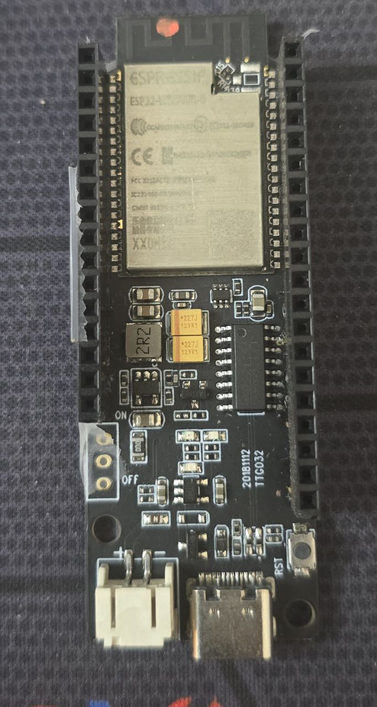
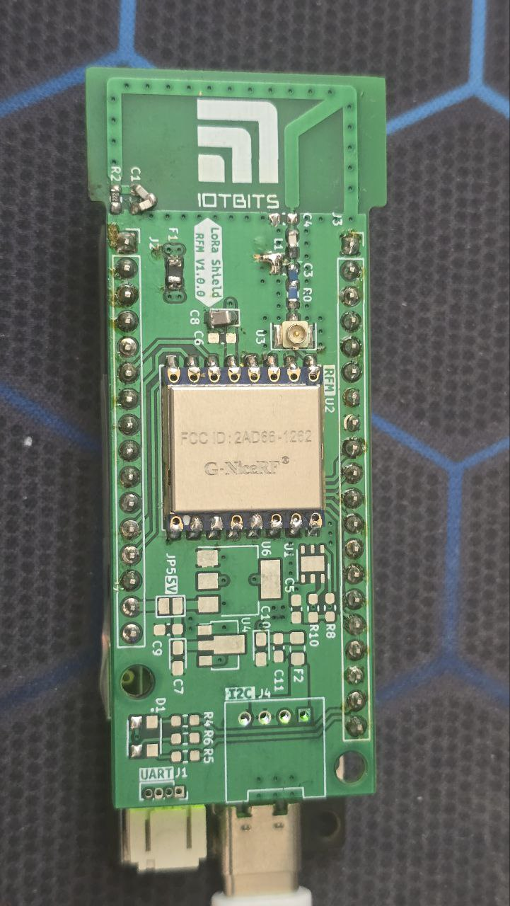
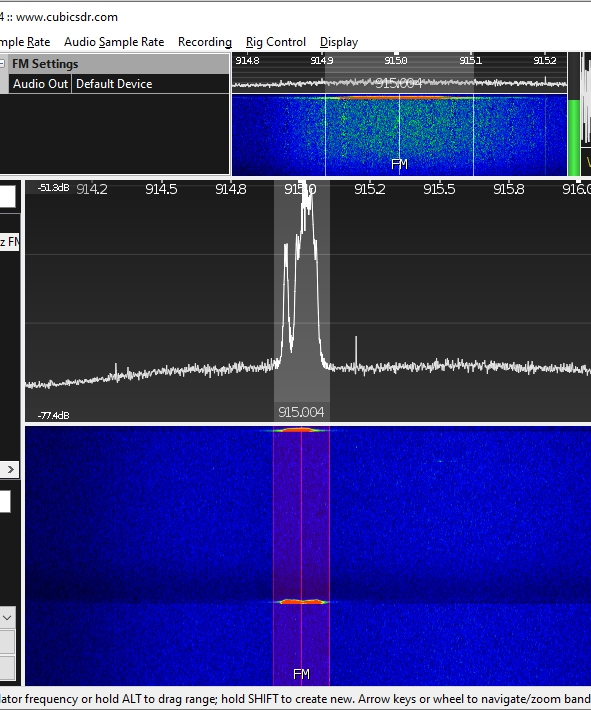

# SX1262 LoRa Module Demo for ESP32

This project demonstrates how to use the NiceRF SX1262 LoRa module with ESP32 development boards using PlatformIO. The project includes both master (transmitter) and slave (receiver) functionality and supports multiple ESP32 board configurations.

**Official Product Page:** https://www.nicerf.com/lora-module/915mhz-lora-module-lora1262.html

## Overview

The SX1262 is a long-range, low-power transceiver based on Semtech's LoRa modulation technology. This demo provides a simple point-to-point communication example between two ESP32 boards equipped with SX1262 modules.

### Features

- LoRa communication at 434.5 MHz or 915 MHz (configurable)
- Support for multiple ESP32 board types (ESP32 Dev Board and ESP32-WROVER-B)
- Configurable transmission power (-9 to +22 dBm)
- Multiple spreading factors (SF5 to SF12)
- Various bandwidth options (7.8 kHz to 500 kHz)
- Coding rates from 4/5 to 4/8
- Master/Slave operation modes

## Hardware Requirements

### Components
- 2x ESP32 development boards
- 2x NiceRF SX1262 LoRa modules
- Jumper wires
- Breadboard (optional)

### ESP32-WROVER-B Development Kit
This project is optimized for the ESP32-WROVER-B development kit:



*ESP32-WROVER-B development kit used in this project*

### Custom PCB Shield
For ESP32-WROVER-B users, a custom shield PCB is available that simplifies connections:



*Custom PCB shield designed for ESP32-WROVER-B with integrated SX1262 module connections*

### Pin Connections

The project supports two ESP32 board configurations with different pin mappings:

#### Configuration 1: ESP32 Dev Board (Default)
To use this configuration, uncomment `#define ESP32DEV_BOARD` in main.cpp

| ESP32 Pin | SX1262 Pin | Function |
|-----------|------------|----------|
| GPIO5     | NSS        | SPI Chip Select |
| GPIO18    | SCK        | SPI Clock |
| GPIO23    | MOSI       | SPI Master Out |
| GPIO19    | MISO       | SPI Master In |
| GPIO16    | NRESET     | Reset Pin |
| GPIO21    | BUSY       | Busy Status |
| GPIO17    | DIO1       | Digital I/O 1 |
| 3.3V      | VCC        | Power Supply |
| GND       | GND        | Ground |

#### Configuration 2: ESP32-WROVER-B Dev Board (Current Default)
To use this configuration, uncomment `#define ESP32WROOM_DEV_BOARD` in main.cpp

| ESP32 Pin | SX1262 Pin | Function |
|-----------|------------|----------|
| GPIO5     | NSS        | SPI Chip Select |
| GPIO18    | SCK        | SPI Clock |
| GPIO23    | MOSI       | SPI Master Out |
| GPIO19    | MISO       | SPI Master In |
| GPIO4     | NRESET     | Reset Pin |
| GPIO12    | BUSY       | Busy Status |
| GPIO14    | DIO1       | Digital I/O 1 |
| 3.3V      | VCC        | Power Supply |
| GND       | GND        | Ground |

⚠️ **IMPORTANT**: Ensure the power supply is **UNDER 3.3V**. Higher voltages will damage the module!

## Software Setup

### Prerequisites
- [PlatformIO](https://platformio.org/) installed in VS Code
- ESP32 platform support

### Project Structure
```
SX1262-NiceRf_OriginalLibrary/
├── platformio.ini          # PlatformIO configuration
├── src/
│   └── main.cpp            # Main application code
├── lib/
│   └── SX1262/             # SX1262 library
│       ├── SX1262.h
│       ├── SX1262.cpp
│       └── library.json
└── README.md
```

## Configuration

### Board Selection

Choose your ESP32 board type by uncommenting the appropriate define in `main.cpp`:

```cpp
// Option 1: ESP32 Dev Board (uses GPIO16, GPIO21, GPIO17)
#define ESP32DEV_BOARD

// Option 2: ESP32-WROVER-B Dev Board (uses GPIO4, GPIO12, GPIO14) - Default
//#define ESP32WROOM_DEV_BOARD
```

### Frequency Selection

Choose your operating frequency by uncommenting the appropriate define in `main.cpp`:

```cpp
// Option 1: 434.5 MHz (ISM band for Europe/Asia)
//#define FREQUENCY 434500000

// Option 2: 915 MHz (ISM band for Americas) - Default
#define FREQUENCY 915000000
```

### LoRa Parameters

The LoRa communication parameters are configured in the `setup()` function:

```cpp
lora_para.rf_freq    = FREQUENCY;      // 434.5 MHz or 915 MHz
lora_para.tx_power   = 10;             // TX Power: 10 dBm
lora_para.lora_sf    = LORA_SF8;       // Spreading Factor: 8
lora_para.band_width = LORA_BW_125;    // Bandwidth: 125 kHz
lora_para.code_rate  = LORA_CR_4_5;    // Coding Rate: 4/5
```

### Available Options

**Transmission Power**: -9 to +22 dBm  
**Spreading Factors**: SF5, SF6, SF7, SF8, SF9, SF10, SF11, SF12  
**Bandwidths**: 7.8, 10.4, 15.6, 20.8, 31.25, 41.7, 62.5, 125, 250, 500 kHz  
**Coding Rates**: 4/5, 4/6, 4/7, 4/8

## Building and Testing

### Step 1: Setup Master Device

1. Open the project in PlatformIO
2. Ensure the `SLAVE` define is commented out in `main.cpp`:
   ```cpp
   //#define SLAVE
   ```
3. Build and upload to the first ESP32:
   ```bash
   pio run -t upload
   ```

### Step 2: Setup Slave Device

1. Uncomment the `SLAVE` define in `main.cpp`:
   ```cpp
   #define SLAVE
   ```
2. Build and upload to the second ESP32:
   ```bash
   pio run -t upload
   ```

### Step 3: Testing

1. **Connect both devices** to their respective serial monitors (115200 baud)

2. **Power on both devices**
   - Master should display: "SX1262 demo master!"
   - Slave should display: "SX1262 demo slave!"

3. **Observe communication**
   - Master transmits "www.nicerf.com" every 10 seconds
   - Slave receives and displays the data with a receive counter

### SDR Verification
You can verify the LoRa transmission using an SDR (Software Defined Radio). Below is an example capture showing the LoRa signal:



*SDR capture showing LoRa signal transmission at the configured frequency*

**Expected Master Output:**
```
Starting  NiceRF SX1262  initialization with NiceRf Sample library...
Calling LoRa1262.Init()...
Init success!
SX1262 demo master!
Frequency: 915000000 Hz
TX Power: 10 dBm
tx_cnt = 1
tx_cnt = 2
tx_cnt = 3
...
```

**Expected Slave Output:**
```
Starting  NiceRF SX1262  initialization with NiceRf Sample library...
Calling LoRa1262.Init()...
Init success!
SX1262 demo slave!
rx_cnt = 1 data:www.nicerf.com
rx_cnt = 2 data:www.nicerf.com
rx_cnt = 3 data:www.nicerf.com
...
```

## Troubleshooting

### Common Issues

1. **"Init fail!" message**
   - Check wiring connections (verify you're using the correct pin configuration for your board)
   - Verify power supply is 3.3V
   - Ensure SX1262 module is properly seated
   - Check that the correct board configuration is selected in code

2. **No communication between devices**
   - Verify both devices use the same LoRa parameters (frequency, SF, BW, CR)
   - Ensure both devices use the same frequency (434.5 MHz or 915 MHz)
   - Check antenna connections
   - Ensure adequate distance (but not too far for initial testing)
   - Verify both devices are using compatible pin configurations

3. **Compilation errors**
   - Verify PlatformIO ESP32 platform is installed
   - Check that all library files are present
   - Ensure only one board configuration is uncommented

### Debug Tips

- Enable debug output by checking the build flags in `platformio.ini`
- Use an oscilloscope to verify SPI communication
- Test with devices close together initially
- Monitor serial output on both devices simultaneously
- Verify the correct board configuration is selected before testing
- Ensure both devices use the same frequency setting

## Frequency Band Selection

This project supports two common LoRa frequency bands:

- **434.5 MHz**: ISM band commonly used in Europe and Asia
- **915 MHz**: ISM band commonly used in Americas

⚠️ **Important**: Ensure you're using the appropriate frequency for your region and comply with local regulations.

## Customization

### Changing Transmission Data
Modify the `tx_buf` array in `main.cpp`:
```cpp
uint8_t tx_buf[]={"Your custom message here"};
```

### Adjusting Transmission Interval
Change the delay in the master loop:
```cpp
delay(10000); // 10 seconds (10000 ms)
```

### Modifying LoRa Parameters
Use the lookup tables provided to change communication parameters:
- `power_table[]` for transmission power
- `sf_table[]` for spreading factors
- `bw_table[]` for bandwidth options
- `cr_table[]` for coding rates

## License

This project uses the NiceRF SX1262 library. Please refer to the original library documentation for licensing information.

## Upcoming Project with NiceRF SX1262

### LoRa Dual Motion Sensor

We're developing an advanced LoRa-based dual motion sensor system using the NiceRF SX1262 module with ESP32-C3. This project will feature:

- **Dual Motion Detection**: Multiple motion sensors for enhanced coverage
- **Low Power Design**: Optimized for battery operation
- **Compact Form Factor**: Custom PCB design for minimal footprint
- **ESP32-C3 Integration**: Latest ESP32 variant with built-in RISC-V processor

#### 3D PCB Preview

**Front View:**


**Back View:**


*3D render of the upcoming LoRa Dual Motion Sensor PCB featuring NiceRF SX1262 and ESP32-C3*

This upcoming project will demonstrate advanced applications of the SX1262 module in IoT sensing applications with long-range wireless communication capabilities.

## References

- [SX1262 Datasheet](https://www.semtech.com/products/wireless-rf/lora-transceivers/sx1262)
- [NiceRF Module Documentation](https://www.nicerf.com/)
- [PlatformIO Documentation](https://docs.platformio.org/)
- [ESP32 Arduino Core](https://github.com/espressif/arduino-esp32)
